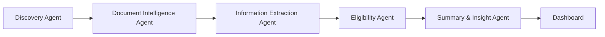
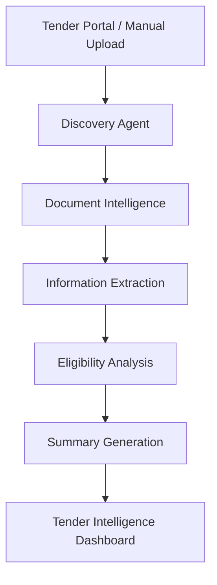
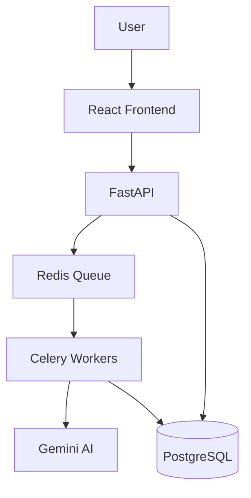

#  Tender Live

<div align="center">


<br>


<br>


</div>

---

# 🌍 Why Tender Live?

### Imagine this...

You receive a **150-page government tender document**.

Now answer these questions within 5 minutes:

✅ What is the eligibility criteria?

✅ What is the submission deadline?

✅ What documents are required?

✅ What are the technical requirements?

✅ What are the risks?

Most people would spend hours finding these answers.

Tender Live does it in seconds.

---

# 🎯 Problem Statement

Government procurement opportunities are scattered across multiple portals.

Businesses face:

🔴 Information Overload

🔴 Manual Document Analysis

🔴 Missed Deadlines

🔴 Complex Eligibility Verification

🔴 Hundreds of Pages of Documentation

🔴 Lost Opportunities

---

# 🚀 Our Solution

Tender Live combines:

* Agentic AI
* Document Intelligence
* Real-Time Tender Discovery
* LLM-Powered Analysis
* Eligibility Intelligence

to automatically transform raw procurement data into actionable business insights.

---

# 🤖 AI Workforce

Tender Live is powered by multiple intelligent agents.



---

## 🔍 Discovery Agent

### Responsibility

* Discover tenders
* Monitor procurement portals
* Trigger workflows

### Output

```text
Tender Metadata
Tender Links
Tender Documents
```

---

## 📄 Document Intelligence Agent

### Responsibility

* Read PDFs
* Extract text
* Understand structure

### Capabilities

* Layout Analysis
* Document Understanding
* Context Detection

---

## 🏷 Information Extraction Agent

### Extracts

* Tender Title
* Budget
* Deadlines
* Department Details
* Required Documents
* Eligibility Requirements

---

## ✅ Eligibility Agent

### Evaluates

Company Profile
VS
Tender Requirements

### Generates

* Match Score
* Qualification Status
* Risk Indicators

---

## 📈 Summary Agent

### Generates

* Executive Summaries
* Key Insights
* Risk Assessment
* AI Recommendations

---

# ⚡ End-to-End Workflow



---

# 🏗 System Architecture



---

# ⚡ Scalable AI Processing

Traditional Architecture ❌

```text
User
 ↓
API Request
 ↓
AI Processing
 ↓
Timeout
```

Tender Live Architecture ✅

```text
User
 ↓
FastAPI
 ↓
Task Created
 ↓
Task ID Generated
 ↓
Response Returned
 ↓
Redis Queue
 ↓
Celery Worker
 ↓
AI Processing
```

Benefits:

✅ Non-blocking APIs

✅ Better Scalability

✅ Background Processing

✅ Faster User Experience

---

# 🔥 Features

## Tender Discovery

* Automated Monitoring
* Procurement Tracking
* Opportunity Discovery

## AI Document Intelligence

* PDF Analysis
* Text Extraction
* Requirement Identification

## Eligibility Intelligence

* Company Matching
* Qualification Analysis
* Opportunity Scoring

## AI Summaries

* Executive Summary
* Risk Assessment
* Recommendations

## Real-Time Updates

* Live Processing
* Streaming Events
* Dashboard Refresh

---

# 🛠 Technology Stack

## Frontend

```yaml
React
TypeScript
Tailwind CSS
Vite
```

## Backend

```yaml
Python
FastAPI
SQLAlchemy
JWT Authentication
```

## AI Engineering

```yaml
Google Gemini
Prompt Engineering
Agentic AI
Document Intelligence
Multi-Agent Systems
```

## Data Layer

```yaml
PostgreSQL
Redis
Celery
```

## Real-Time Layer

```yaml
Server Sent Events
StreamingResponse
```

---

# 📊 Project Statistics

```text
5 Specialized AI Agents

100+ Tender Documents Analyzed

500+ Pages Processed

Real-Time Event Streaming

Asynchronous AI Processing

Multi-Agent Workflow Architecture
```

---

# 🚀 Future Roadmap

### Phase 1

* Live CPPP Integration
* Live GeM Integration

### Phase 2

* AI Bid Assistant
* Tender Recommendation Engine

### Phase 3

* Predictive Procurement Analytics
* Enterprise Intelligence Platform

### Phase 4

* Autonomous Procurement Copilot

---

# 👩‍💻 Team

## Yashasvi

### AI Engineer & Agentic AI Developer

Focused on:

* Agentic AI Architecture
* Multi-Agent Workflows
* Document Intelligence
* LLM Integration
* Prompt Engineering
* Eligibility Intelligence
* AI Orchestration

---

# 🎖 Innovation

Tender Live is not another tender listing platform.

It is an **AI Procurement Intelligence System** capable of:

✔ Understanding Documents

✔ Extracting Information

✔ Evaluating Eligibility

✔ Generating Insights

✔ Supporting Business Decisions

---

<div align="center">

## 🚀 Tender Live

### From Tender Discovery ➜ Tender Intelligence


</div>
