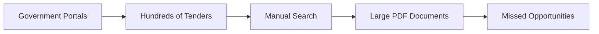
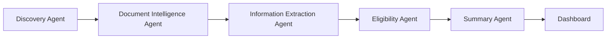
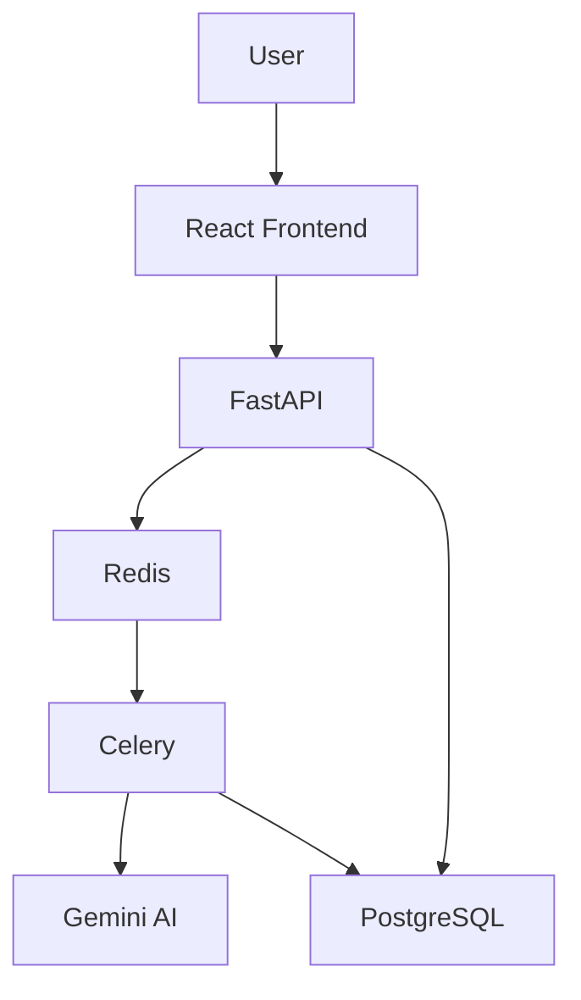
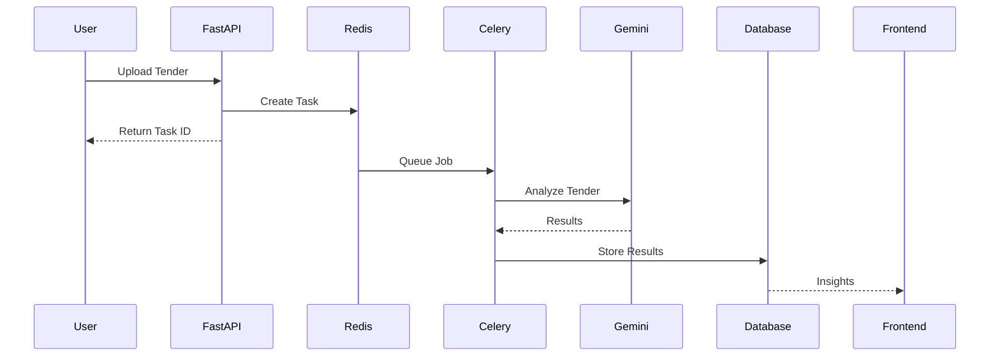

# 🚀 Tender Live

<div align="center">

### 🤖 Agentic Tender Discovery & Intelligence Platform


<br>


</div>

---

## ⚡ Problem



---

## 🚀 Solution

Tender Live converts:

```text
Raw Tender Documents
          ↓
     AI Analysis
          ↓
 Business Intelligence
          ↓
 Better Decisions
```

---

# 🤖 AI Agent Workforce



### 🔍 Discovery Agent

Finds tenders automatically.

### 📄 Document Intelligence Agent

Reads and understands tender documents.

### 📊 Information Extraction Agent

Extracts eligibility, budget, deadlines.

### ✅ Eligibility Agent

Evaluates company qualification.

### 💡 Summary Agent

Generates insights and recommendations.

---

# 🏗 Architecture



---

# ⚡ Asynchronous AI Pipeline



---

# 🔥 Tech Stack

| Layer      | Technology         |
| ---------- | ------------------ |
| Frontend   | React + TypeScript |
| Backend    | FastAPI            |
| AI         | Gemini             |
| Queue      | Redis              |
| Workers    | Celery             |
| Database   | PostgreSQL         |
| Real-Time  | SSE                |
| Deployment | Docker             |

---

# 🎯 Features

✅ Multi-Agent AI Workflow

✅ Tender Discovery

✅ Document Intelligence

✅ Eligibility Evaluation

✅ Real-Time Processing

✅ AI Summaries

✅ Insight Generation

---

<div align="center">

## 🚀 Tender Live

### "Businesses should spend time winning tenders, not searching for them."

</div>
